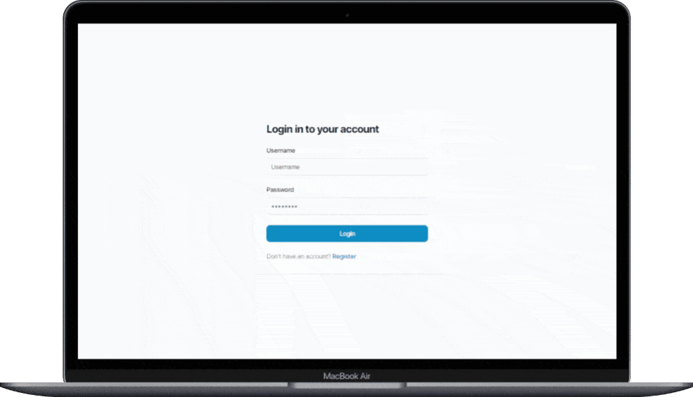

# Desafio Play For A Cause

## Meus Desafios?

Decidi ainda mais desafiar a minha capacidade de aprender e a minha vontade de se superar.

Primeiro contato com:

- GraphQL
- PostgreSQL (Mas já sei SQL)
- Prisma (ORM)
- ~~WebSockets~~
- NextJS
- Zod
- react-query
- React Hook Form

## Por que a aplicação está incompleta (servidor/cliente)?

Para não colocar código duvidoso, decidi usar **apenas a documentação**, sem vídeos e códigos de terceiros.

Mas isso **me levou tempo**, principalmente no front-end (*principalmente no refresh*).

### Front-end

Página de login/register funcional e não é tão responsivo. O tratamento do formulário com Zod e React Hook Form é interessante.

Não achei maneiras rápidas de implementar o chat em si com qualidade aceitável. (*visto que o front me levou tempo com a documentação.*)
Acredito que o uso do react-query seria implementado nesta página (chat).

#### Página de Login

Ao fazer login, o nome ele recebe um token e é direcionado para página chat que a princípios só é acessada com o token.

	

#### Página de Registro

Ao se registrar, caso sucesso, nada ainda é retornado.
Caso falhe, é mostrado na tela graças ao React Hook Form.

	

### Back-end

Ainda não foi implementado um código para retornar erros melhores ao fazer requisições GraphQL.\
A qualidade do tratamento dos dados que são enviados é simples, praticamente é só o schema do GraphQL.

Já usei Socket.IO, porém WebSocket em si, não. De qualquer forma, não teria dificuldade em implementar o real time.

Se eu tivesse focado mais tempo, com certeza teria um back-end mais robusto.

## Considerações

Tenho noção de que a minha abordagem de ir pelo caminho com menos afinidade e de que há aplicações entregues que estão mais maduras e até robustas possa me prejudicar.

Mas ainda acredito não só ter o perfil e a capacidade, mas potencial para preencher a vaga e futuramente ser uma peça importante no back-end, trazendo qualidades significativas para qualquer aplicação.

De qualquer forma, concordo com a **precariedade da aplicação** no geral.

## Tarefa

*"Você foi contratado para implementar uma aplicação de chat. Esta solução deverá prover um mecanismo de autenticação simples, contando com o cadastro do usuário indicando um email, nome de usuário e senha. A aplicação deverá armazenar as mensagens enviadas pelos usuários, que também deverão receber em tempo real as mensagens enviadas pelos demais usuários."*
